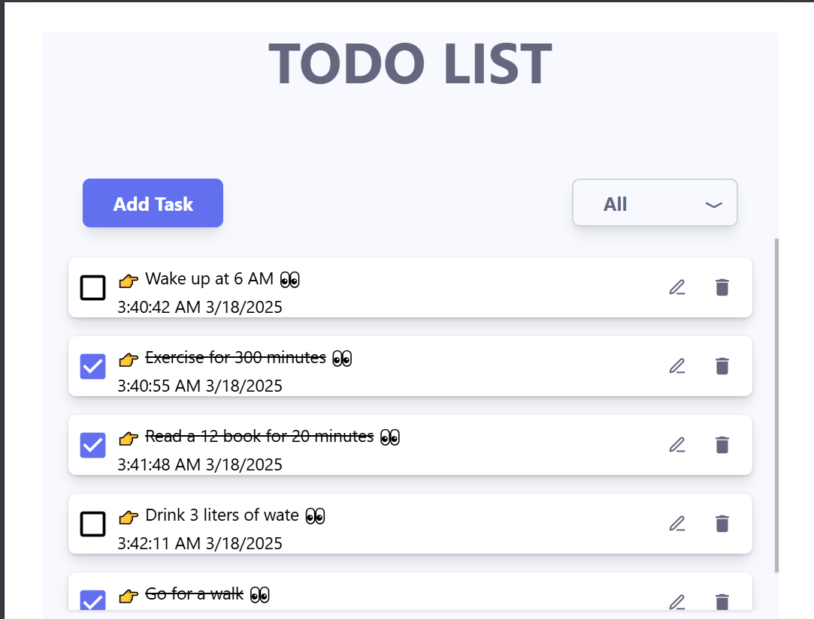
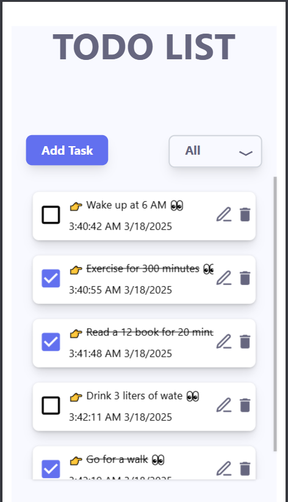
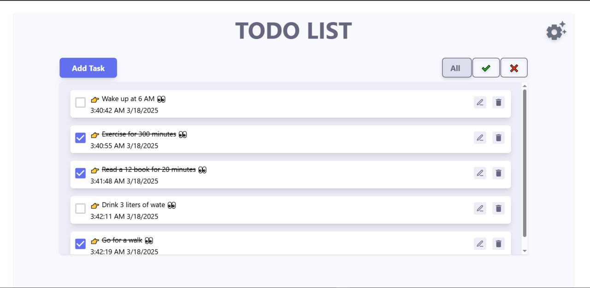
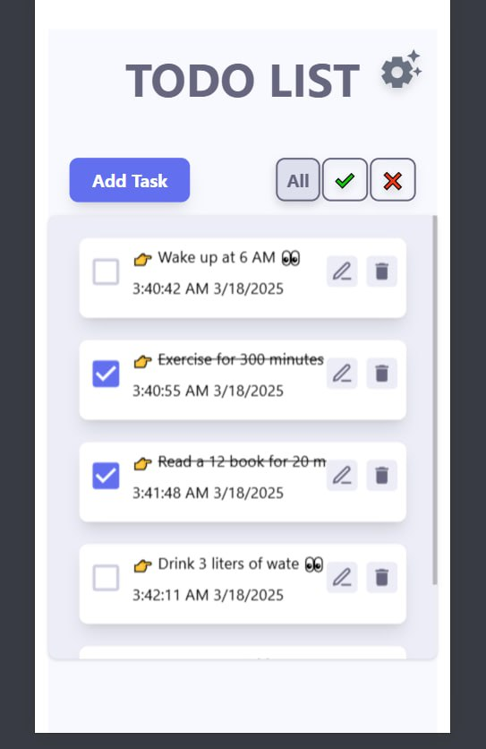
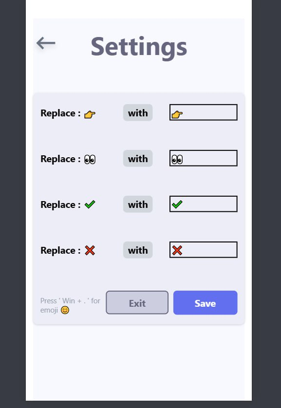

<!-- 

    
    
    

 -->

# To-Do List App

## 🔖 Introduction

The **To-Do List** app is a simple web application that helps you manage your daily tasks easily and efficiently.

## ✨ Features

- ➕ Add new tasks
- ✔️ Mark tasks as completed
- 🖊️ Edit tasks
- 🗑️ Delete tasks
- 🔎 Filter completed and uncompleted tasks
- 🎭 Customize and change emojis through settings

## 🛠️ Technologies Used

- **React** 🔵 - For building the interactive UI
  - **Hooks used:** `useContext`, `useState`, `useMemo`, `useEffect`, `useReducer`
  - **External Library:** `react-router-dom` for page navigation
- **Vite** ⚙️
- **Tailwind CSS 4**

## 📸 App Screenshots

---

✨ Don't forget to ⭐ the project on GitHub if you liked it! 
